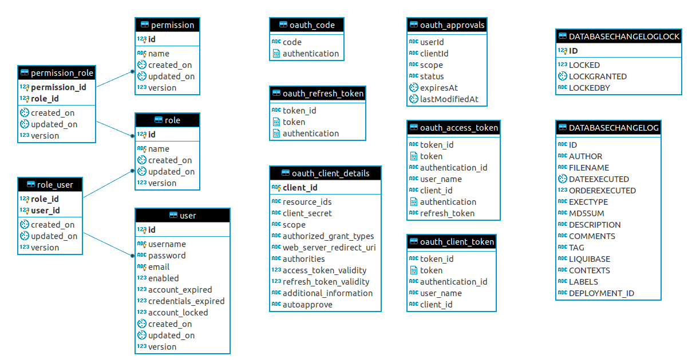

# Spring Boot 2 Oauth2 with JWT

[Spring Boot 2 (2.0.3)](https://spring.io/blog/2018/06/14/spring-boot-2-0-3-available-now) Oauth2 with JWT token with MySql.


## 1- Install

Clone or download this repo and import it as a maven project.
You will need to activate Lombok. For more information see the dependencies.

### 1.1- MySql Database

Inside the application.yml under the `auth/src/main/resources` folder, change these values to connect to your MySQL

```
  datasource:
    url: jdbc:mysql://${db.host:localhost}:${db.port:3306}/${db.name:auth_service}?useSSL=false
    username: ${db.uid:root}
    password: ${db.pwd:password123}

```

#### 1.1.1- DER




### 1.2- keyStore .jks (Optional)

In order to create a keyStore for your Auth service, execute the following commands:
```
$ keytool -genkeypair -alias jwt -keyalg RSA -keypass password -keystore jwt.jks -storepass password

$ keytool -importkeystore -srckeystore jwt.jks -destkeystore jwt.jks -deststoretype pkcs12
```

Export the public key for the resource servers:
```
$ keytool -list -rfc --keystore jwt.jks | openssl x509 -inform pem -pubkey</p>
```

Copy the file to the `resources` folder.


## 2- Usage

### 2.1- Users and Clients

### 2.2- CURL examples

### 2.3- Login

## 3- Dependencies

- [Spring Security (spring-cloud-starter-oauth2)](https://mvnrepository.com/artifact/org.springframework.cloud/spring-cloud-starter-oauth2)
- JDBC Storage (MySql)
- [Liquibase](https://www.liquibase.org/)
- [Thymeleaf](https://www.thymeleaf.org/)
- [Lombok](https://projectlombok.org/)
- [Checkstyle](http://checkstyle.sourceforge.net/)
- [Editorconfig](https://editorconfig.org/)
